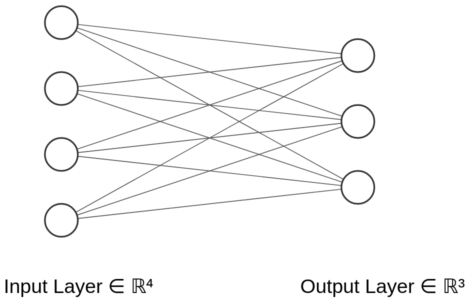

# Straightforward NN representation in code

Here is the graph of a neural network with 4 input neurons and 3 output neurons:

<p align="center">
  
</p>

## Generating output layer without loops

```py
# 4 input neurons.
inputs = [1, 2, 3, 2.5]

# 4 Connections (columns) to each output neuron (3 rows)
weights = [
    [0.2, 0.8, -0.5, 1.0],
    [0.5, -0.91, 0.26, -0.5],
    [-0.26, -0.27, 0.17, 0.87]
]

# 3 Biases (for output neurons).
biases = [2, 3, 2]

# 3 Outputs (for output neurons)
output1 = inputs[0] * weights[0][0] + inputs[1] * weights[0][1] + \
    inputs[2] * weights[0][2] + inputs[3] * weights[0][3] + biases[0]

output2 = inputs[0] * weights[1][0] + inputs[1] * weights[1][1] + \
    inputs[2] * weights[1][2] + inputs[3] * weights[1][3] + biases[1]

output3 = inputs[0] * weights[2][0] + inputs[1] * weights[2][1] + \
    inputs[2] * weights[2][2] + inputs[3] * weights[2][3] + biases[2]

output = [output1, output2, output3]
```

## Representing output layer with loops

```py
# 4 input neurons.
inputs = [1, 2, 3, 2.5]

# 4 Connections (columns) to each output neuron (3 rows)
weights = [
    [0.2, 0.8, -0.5, 1.0],
    [0.5, -0.91, 0.26, -0.5],
    [-0.26, -0.27, 0.17, 0.87]
]

# 3 Biases (for output neurons).
biases = [2, 3, 2]

outputs = []

for bias, weight in zip(biases, weights):
  output = 0
  for w, i in zip(inputs, weight):
    output += i * w

  output += bias
  outputs.append(output)
```

## Using numpy

```py
import numpy as np

# 4 input neurons.
inputs = [1, 2, 3, 2.5]

# 4 Connections (columns) to each output neuron (3 rows)
weights = [
    [0.2, 0.8, -0.5, 1.0],
    [0.5, -0.91, 0.26, -0.5],
    [-0.26, -0.27, 0.17, 0.87]
]

# 3 Biases (for output neurons).
biases = [2, 3, 2]

outputs = np.dot(weights, inputs)
```
